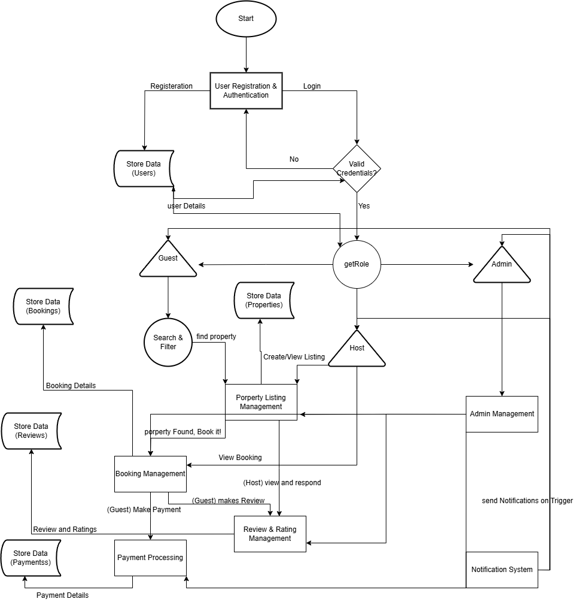

# Airbnb Clone Backend Data Flow Diagram (DFD)

This directory contains the Data Flow Diagram (DFD) for the Airbnb Clone backend project.

## Data Flow Diagram

---

## Diagram Description

The Data Flow Diagram (DFD) above illustrates how data moves through the core backend operations of the Airbnb Clone system. It covers the main entities, processes, and data stores involved in the application.

### **Key Entities**
- **Guest, Host, Admin:** Users who interact with the system, each with different roles and permissions.
- **Payment Service:** External service for processing payments.

### **Core Processes**
- **User Registration & Authentication:** Handles new user sign-ups and login attempts.
- **getRole:** Determines the user's role after authentication to route them to the appropriate functionalities.
- **Property Listing Management:** Allows hosts to create, update, or remove property listings.
- **Search & Filter:** Enables guests to search for properties based on various criteria.
- **Booking Management:** Manages the creation, viewing, and cancellation of bookings.
- **Payment Processing:** Handles payment transactions and communicates with the payment service.
- **Review & Rating Management:** Allows guests to leave reviews and hosts to respond.
- **Admin Management:** Enables admins to oversee users, listings, bookings, and payments.
- **Notification System:** Sends notifications to users based on system events.

### **Data Stores**
- **Users:** Stores user information and credentials.
- **Properties:** Stores property listings and details.
- **Bookings:** Stores booking records and statuses.
- **Payments:** Stores payment transaction data.
- **Reviews:** Stores guest reviews and host responses.

### **Data Flow**
- Data flows from users and external services into backend processes, which then interact with the relevant data stores.
- Each process reads from and writes to the appropriate data store, ensuring data consistency and integrity.
- The diagram also shows how the system routes users based on their roles and how payment processing interacts with external services.

---

This DFD provides a high-level overview of how information is managed and transferred within the Airbnb Clone backend, supporting the development of a robust and scalable system.