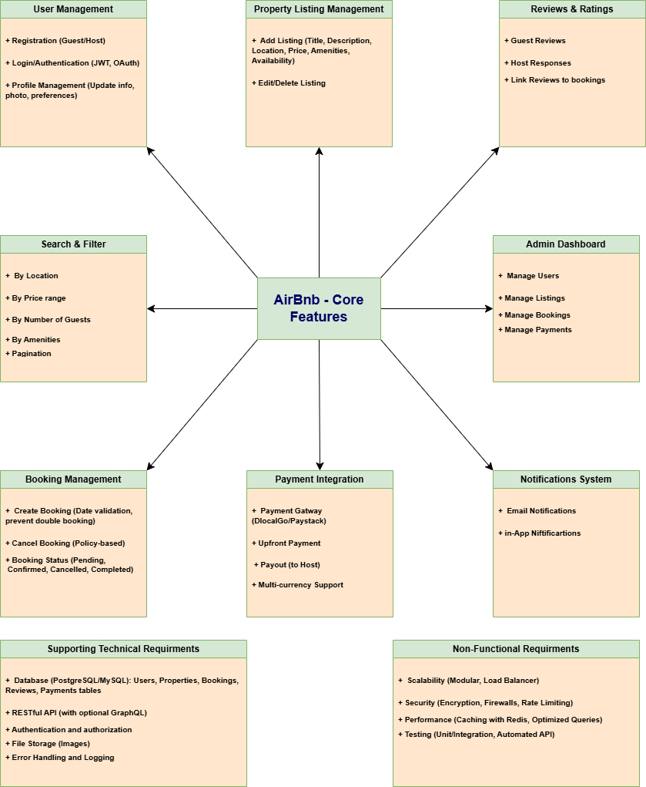

# Airbnb Clone Backend Features and Functionalities
## Features and Functionalities Diagram

---

## Core Modules

- **User Management**
  - Registration (Guest/Host)
  - Login/Authentication (JWT, OAuth)
  - Profile Management

- **Property Listings Management**
  - Add/Edit/Delete Listings

- **Search & Filtering**
  - By Location, Price, Guests, Amenities
  - Pagination

- **Booking Management**
  - Create/Cancel Booking
  - Booking Status

- **Payment Integration**
  - Payment Gateway
  - Payouts
  - Multi-currency

- **Reviews & Ratings**
  - Guest Reviews
  - Host Responses

- **Notifications System**
  - Email & In-app Notifications

- **Admin Dashboard**
  - Manage Users, Listings, Bookings, Payments

## Technical Requirements

- Relational Database (PostgreSQL/MySQL)
- RESTful API (optional GraphQL)
- JWT Authentication, RBAC
- File Storage for Images
- Error Handling & Logging

## Non-Functional Requirements

- Scalability, Security, Performance, Testing