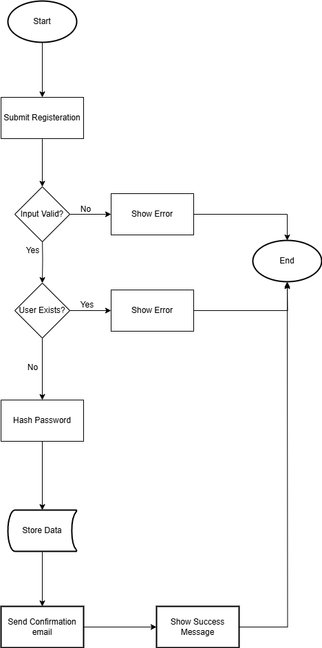

# Backend Process Flowchart: User Registration

This directory contains a flowchart visualizing the workflow and data flow for the user registration process in the Airbnb Clone backend.

## Flowchart

---

## Description

The flowchart above outlines the step-by-step process for user registration:

1. **User submits registration form** with required details.
2. **System validates the input data** for correctness and completeness.
3. **Check if the user already exists** in the database.
   - If the user exists, an error message is shown.
   - If not, the system hashes the password and stores the new user data.
4. **A confirmation email is sent** to the user.
5. **A success message is displayed** to confirm registration.

This flowchart helps visualize the backend logic and data flow, ensuring a robust and user-friendly registration process.