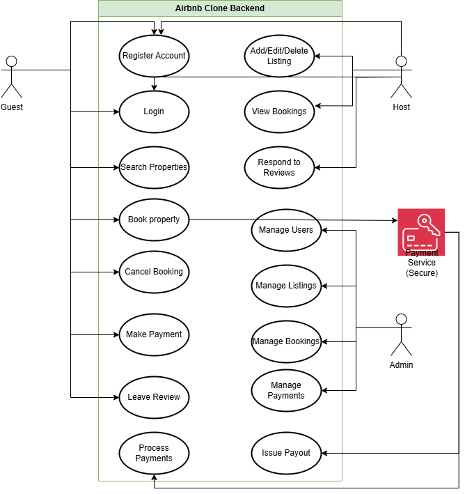

# Airbnb Clone Backend Use Case Diagram

This directory contains the use case diagram for the Airbnb Clone backend project.

## Use Case Diagram

---

## Diagram Description

The use case diagram above visualizes the key interactions between different types of users (guests, hosts, admins) and the backend system. Each actor is represented outside the system boundary and is connected to the functionalities they can access, such as user registration, property listing management, booking, and payments.

- **Guests** can register, log in, search for properties, book stays, make payments, and leave reviews.
- **Hosts** can register, log in, add or manage property listings, view bookings, and respond to reviews.
- **Admins** have access to manage users, listings, bookings, and payments for overall system oversight.
- **Payment Service** is shown as an external system that handles payment processing and payouts.

This diagram helps clarify which user roles interact with which backend features, ensuring all critical functionalities are captured and that the system design aligns with user needs.
